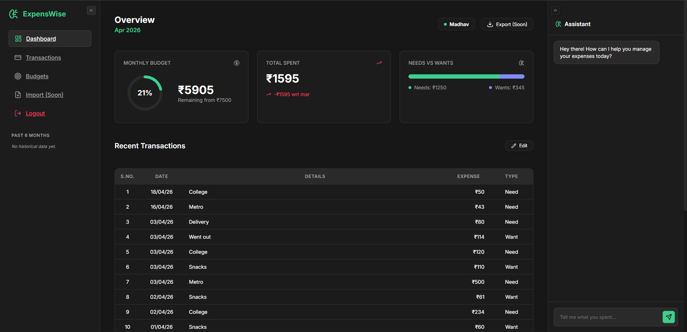
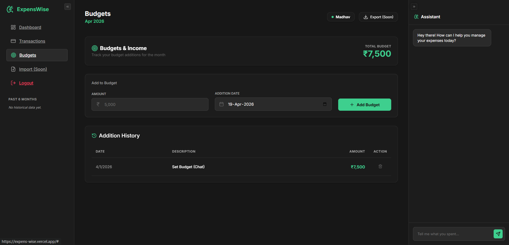
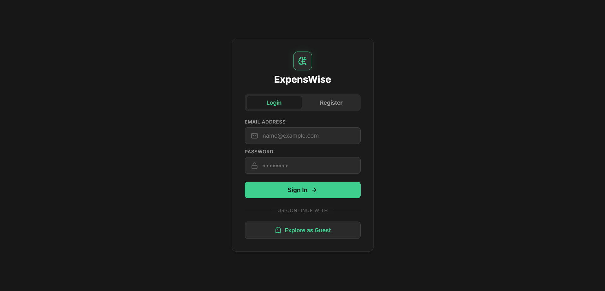

# ExpensWise 2.0 💸

ExpensWise is a smart personal finance tracker that doesn't feel like a second job. Instead of wrestling with complex forms or staring at boring spreadsheets, you just talk to it. Built with a focus on speed, AI-driven insights, and a sleek dark-mode aesthetic.

[Live Demo](https://expenswise.vercel.app) (Placeholder - update with your actual link)

## Why I Built This
Most finance apps are a chore. You spend more time categorizing transactions than actually understanding where your money is going. I wanted something where I could just type `200 for pizza` or `paid 500 for rent need` and have it handled automatically. ExpensWise takes away the friction of manual data entry so you actually *want* to track your spend.

## Features
- **Natural Language Parsing:** Log expenses, set budgets, or query your history using raw text.
- **Smart Insights:** Uses Gemini AI to analyze your spending habits and give you blunt, actionable advice.
- **Needs vs. Wants:** Automatically categorizes your spend so you know if you're over-investing in "wants."
- **Persistent Guest Mode:** Try it out without an account—your data persists across sessions.
- **CSV Export:** Because sometimes you just need to crunch the numbers in a sheet.
- **Responsive Dashboard:** Real-time metrics comparing your current run-rate against historical averages.

## Tech Stack
- **Frontend:** React + Vite (Vanilla CSS, Framer Motion, Recharts)
- **Backend:** Node.js (Express 5.0)
- **Database:** PostgreSQL (via Prisma ORM)
- **AI Integration:** Google Gemini API
- **Auth:** JWT + Bcrypt

## Under the Hood: Natural Language Parsing
The "magic" behind the input box isn't just a bunch of regex. It uses a custom-prompted Gemini Flash model to perform **Intent Classification** and **Entity Extraction** in a single pass.

When you type `food 100 need; taxi 200 want`, the backend:
1. Identifies multiple transactions separated by `;`.
2. Classifies each as an `ADD_EXPENSE`.
3. Extracts the `amount`, `description`, and `categoryType`.
4. Calculates any math expressions (e.g., `100+50 for breakfast`).
5. Returns structured JSON that the database can actually understand.

## Screenshots
<div align="center">
  
  <br>
  
  <br>
  
</div>

## Getting Started
1. **Clone & Install:**
   ```bash
   npm install
   cd frontend && npm install
   ```
2. **Environment Setup:**
   Create a `.env` in the root with `DATABASE_URL`, `GEMINI_API_KEY`, and `JWT_SECRET`.
3. **Run:**
   ```bash
   npm run dev       # Backend
   cd frontend && npm run dev  # Frontend
   ```

---
*Built for developers who care about where their money goes.*
